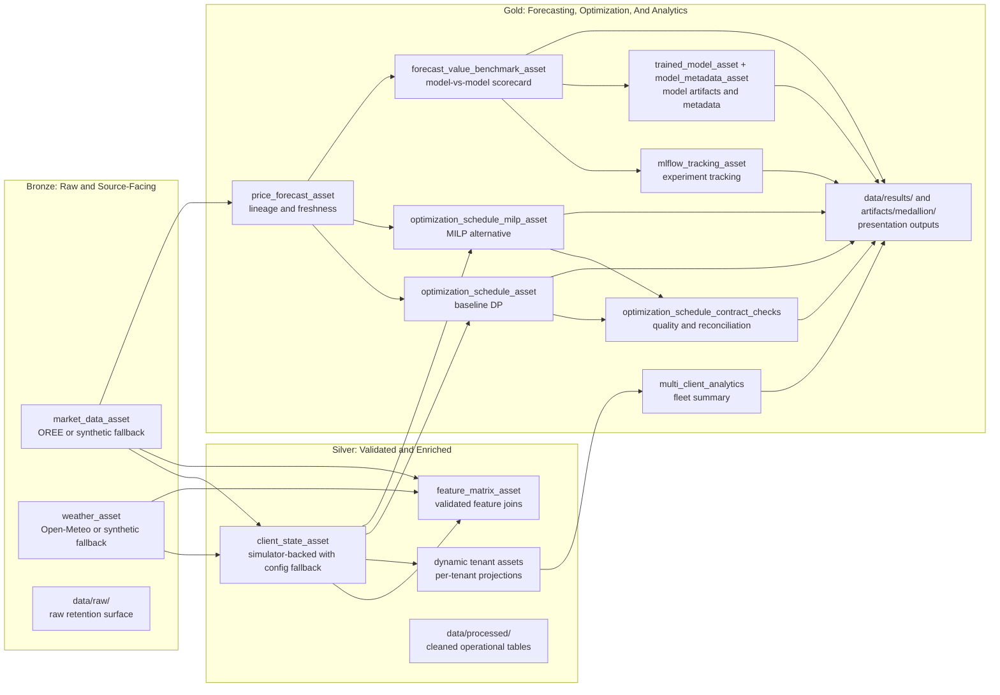

# Dagster Bronze/Silver/Gold Supervisor Architecture

This document packages the active Dagster runtime in [src/definitions.py](../../src/definitions.py) as a supervisor-facing Bronze/Silver/Gold architecture. It is a logical presentation overlay for the current asset graph, storage folders, and benchmark surfaces. It is not a storage rewrite, not a lakehouse migration, and not a new runtime topology.

The machine-readable source of truth for this package is [artifacts/medallion/medallion_dataset_manifest.yaml](../../artifacts/medallion/medallion_dataset_manifest.yaml).

## Scope Guardrails

- The active Dagster runtime remains rooted at [src/definitions.py](../../src/definitions.py).
- Bronze, Silver, and Gold are logical layers over the current assets and folders, not a claim that the repo already uses a physical medallion warehouse layout.
- Real-data, simulator-backed, benchmark-derived, and synthetic-fallback-capable surfaces are distinguished explicitly.
- Benchmark, MLflow, lineage, reconciliation, and multi-tenant analytics remain the system of record for supervisor evidence.
- Any future physical re-root toward a `backend/...` layout is deferred to a separate architecture effort.

## Runtime Summary

The active pipeline already has the shape needed for a medallion narrative:

- Bronze: source-facing ingestion and raw retention for market and weather data, with explicit fallback behavior.
- Silver: validated and enriched operational state for client telemetry, tenant context, and feature engineering.
- Gold: decision-support, forecasting, optimization, benchmarking, MLflow/model metadata, reconciliation, and fleet analytics.

Dagster job boundaries align to that story:

- `daily_data_refresh` materializes the operational chain from source ingest through Gold-layer schedule outputs.
- `optimization_schedule_contract_checks` keeps schedule quality and lineage validation inside Dagster.
- `benchmark_engines` owns forecast benchmark and MLflow experiment tracking.
- `model_training` owns trained-model and model-metadata outputs.
- `multi_tenant_analytics` owns fleet-wide comparative analytics.

## Bronze/Silver/Gold Mapping

| Layer | Current Dagster surfaces | Current storage surface | Supervisor interpretation |
| --- | --- | --- | --- |
| Bronze | `market_data_asset`, `weather_asset` | `data/raw/` | Raw or source-facing acquisition with explicit provenance and fallback behavior |
| Silver | `client_state_asset`, `feature_matrix_asset`, dynamic tenant assets | `data/processed/` | Validated, normalized, and enriched operational datasets |
| Gold | `price_forecast_asset`, `optimization_schedule_asset`, `optimization_schedule_milp_asset`, `forecast_value_benchmark_asset`, `mlflow_tracking_asset`, `trained_model_asset`, `model_metadata_asset`, `multi_client_analytics`, schedule asset checks | `data/results/`, `artifacts/medallion/` | Business-facing analytics, ML outputs, optimization decisions, benchmark scorecards, and supervisor summaries |

## Real, Simulated, And Fallback Provenance

The current runtime does not use a single provenance class. The package is only accurate if those differences stay visible:

- Real-source with synthetic fallback: [src/assets/core/market.py](../../src/assets/core/market.py) pulls OREE prices and falls back to synthetic market data when the source is unavailable.
- Real-source with synthetic fallback: [src/assets/core/weather.py](../../src/assets/core/weather.py) pulls Open-Meteo forecasts and falls back to synthetic weather data for local or degraded runs.
- Simulator-backed with config fallback: [src/assets/core/client_state.py](../../src/assets/core/client_state.py) prefers simulator-backed battery telemetry and falls back to configuration defaults when operational state is missing.
- Gold lineage and freshness: [src/assets/core/price_forecast.py](../../src/assets/core/price_forecast.py) and [src/assets/core/optimization_schedule.py](../../src/assets/core/optimization_schedule.py) already emit run IDs, freshness, horizon mode, and model metadata.
- Benchmark-derived and reconciliation-backed evidence: [src/assets/benchmarks/performance.py](../../src/assets/benchmarks/performance.py), [src/assets/benchmarks/model_training.py](../../src/assets/benchmarks/model_training.py), and [src/assets/core/optimization_schedule_checks.py](../../src/assets/core/optimization_schedule_checks.py) provide the experiment and contract evidence path.

## Mermaid View

## Layer Details

### Bronze

Bronze is the source-facing layer. It captures externally sourced market and weather data, plus the raw retention surface used for supervisor narration.

- `market_data_asset` is Bronze because it acquires OREE market data and exposes explicit fallback behavior.
- `weather_asset` is Bronze because it acquires Open-Meteo forecast data and exposes explicit fallback behavior.
- `data/raw/` is the physical storage anchor for the Bronze story, even though the Dagster IO manager may persist some assets elsewhere when S3 is configured.

### Silver

Silver is the validated and enriched operational layer.

- `client_state_asset` is Silver because it joins market and weather inputs with tenant configuration and simulator-backed telemetry into a normalized operational state.
- `feature_matrix_asset` is Silver because it turns Bronze and client-state data into a validated ML-ready feature table.
- Dynamic tenant assets created by the asset factory also fit the Silver story because they project shared operational data into per-tenant slices.
- `data/processed/` is the presentation storage anchor for validated and intermediate operational tables.

### Gold

Gold is the decision-support and presentation layer.

- `price_forecast_asset` is Gold because it provides forecast outputs with freshness, lineage, and promotion metadata.
- `optimization_schedule_asset` and `optimization_schedule_milp_asset` are Gold because they produce business-facing charge/discharge schedules and economic outcomes.
- `optimization_schedule_contract_checks` is part of the Gold evidence path because it validates schedule completeness, numeric integrity, lineage stability, and realized-value reconciliation.
- `forecast_value_benchmark_asset`, `mlflow_tracking_asset`, `trained_model_asset`, and `model_metadata_asset` are Gold because they support supervisor-facing experiment comparison rather than raw operational ingestion.
- `multi_client_analytics` is Gold because it aggregates fleet-wide rankings and cross-client comparison metrics.
- `data/results/` and `artifacts/medallion/` are the presentation storage anchors for Gold outputs.

## Fleet-Wide And Case-Study Evidence

The generated Gold summary artifact at [artifacts/medallion/gold_experiment_summary.json](../../artifacts/medallion/gold_experiment_summary.json) packages both breadth and one concrete story without changing the runtime.

### Fleet-wide view

The fleet summary is anchored on `multi_client_analytics` and currently presents a five-client comparative slice.

- Fleet source surface: `multi_client_analytics`
- Local fleet status: `materialized_asset`
- Client count in the current slice: `5`
- Top storage client: `client_001_kyiv_mall` tagged `simulated`
- Top solar client: `client_001_kyiv_mall` tagged `simulated`

These rankings are simulated or configuration-derived comparative analytics, not live field telemetry. They are still useful for supervisor presentation because they show that the runtime already supports a fleet-level comparison lane.

### Case-study view

The stable case-study tenant for this package is `client_001_kyiv_mall` (`Kyiv Shopping Mall`). The renderer can override this with `--case-study-tenant`, but the default supervisor pack uses this tenant because it is the first stable customer profile in [customers.yaml](../../customers.yaml).

| Metric | Value | Provenance |
| --- | ---: | --- |
| Battery capacity | 280 kWh | simulated |
| Solar capacity | 150 kW | simulated |
| Peak load | 200 kW | simulated |
| Storage hours | 1.4 | simulated |
| Solar coverage ratio | 0.75 | simulated |
| Market input mode | fallback-derived | fallback-derived |
| Weather input mode | real | real |
| Client-state mode | simulated | simulated |

The case-study slice is intentionally honest about provenance: the market lane is currently fallback-derived in the local environment, the weather lane is real, and the client-state lane is simulator-backed. That keeps the supervisor package from over-claiming operational maturity while still showing how the Bronze, Silver, and Gold layers fit together.

## Current Repo Layout And Deferred Future Direction

The current runtime layout is intentional and remains the source of truth for this program:

- [src/definitions.py](../../src/definitions.py) is the Dagster entrypoint.
- [src/assets/core](../../src/assets/core), [src/assets/benchmarks](../../src/assets/benchmarks), and [src/assets/multi_tenant](../../src/assets/multi_tenant) own the active Dagster asset graph.
- [src/data_pipeline](../../src/data_pipeline) is the shared backend logic surface for reusable helpers.
- [scripts](../../scripts) stays thin and CLI-focused.
- [dashboard](../../dashboard) consumes runtime outputs but is not being redesigned in this program.

A clearer future package boundary such as `backend/api/dagster_pipeline/...` may be useful later, but that is a deferred architecture direction only. This package does not move code, does not re-root the repo, and does not claim that the physical layout already matches that future target.

## Limitations And Explicit Deferrals

- This is a logical overlay for supervisor communication, not a physical medallion storage implementation.
- Bronze-source assets can fall back to synthetic data in degraded or local runs.
- Silver client state can be simulator-backed or config-backed instead of live field telemetry.
- Gold experiment evidence depends on optional local MLflow, benchmark, and reconciliation surfaces that may not be populated in every environment.
- The current program does not change optimizer behavior, rolling-horizon control logic, dashboard design, or the broader hardening roadmap.
- Any future backend re-root or architecture ADR remains separate work.