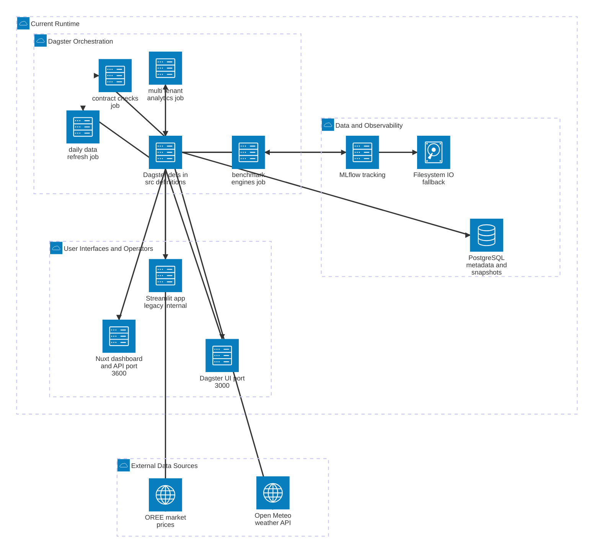

# Smart Energy AI Current Runtime Diagram

This Mermaid chart shows the current runtime topology for the local Smart Energy AI stack. It summarizes the active runtime surfaces around Dagster, the dashboard, data persistence, and observability instead of reproducing the low-level asset graph.

For detailed Dagster asset dependencies and job wiring, see [docs/technical/DAGSTER_PIPELINE_DEPENDENCY_MAP.md](docs/technical/DAGSTER_PIPELINE_DEPENDENCY_MAP.md).

Notes:
- Scope is the current runtime stack described by the active workspace, local launcher, and compose services.
- The AWS free tier target deployment remains documented separately in the technical architecture docs and is intentionally omitted here.
- Streamlit is shown as a secondary legacy or internal surface because it still exists in the repo, but the current local runtime guidance centers on Dagster and the Nuxt dashboard.